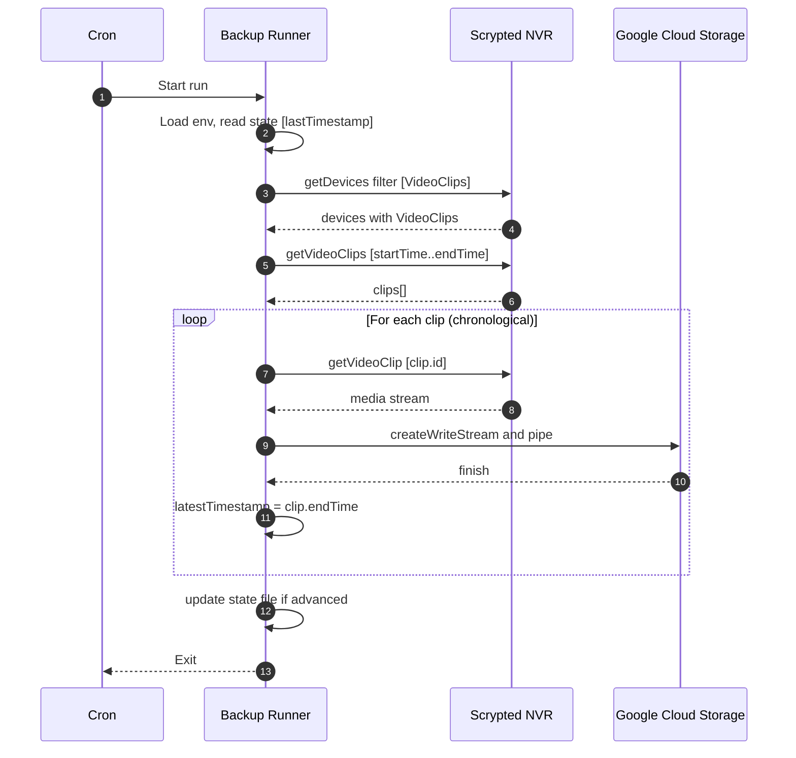

# Architecture — Scrypted NVR Off‑Site Backup (v4)

Version: v4  
Owner: Engineering  
Status: Draft  
Last updated: 2025-09-18

1. System overview
This system performs periodic, programmatic extraction of completed video clips from a local Scrypted NVR and streams them to Google Cloud Storage Standard, relying on a 7‑day lifecycle deletion rule for cost control. It emphasizes transactional integrity, streaming I/O, idempotent state progression, and minimal operational burden.

Core components:
- Scrypted NVR: Provides the VideoClips interface
- Backup Runner: Node.js TypeScript job, entrypoint [main()](src/backup.ts:190), scheduler via cron
- Google Cloud Storage: Destination bucket with lifecycle rule age>7d
- State Store: JSON file tracking lastTimestamp, see [readLastTimestamp()](src/backup.ts:68), [updateLastTimestamp()](src/backup.ts:84)

2. High‑level flow
- On schedule start, load config and lastTimestamp
- Discover VideoClips devices, enumerate clips in [lastTimestamp, now]
- For each clip (chronological order), fetch media stream and upload to GCS using streaming writer
- Only after successful upload, advance in‑memory latestTimestamp to clip.endTime
- After loop, persist latestTimestamp if advanced and exit

3. Sequence diagram

4. Module decomposition
- Extractor
  - Responsibilities: Device discovery, clip listing, media retrieval
  - Interfaces: Scrypted VideoClips via [ScryptedInterface.VideoClips](src/backup.ts:166)
  - Key ops: [extractNewClips()](src/backup.ts:159), with [withRetry()](src/backup.ts:34) resilience
- Uploader
  - Responsibilities: Stream upload to GCS without buffering entire file
  - Key ops: [uploadToGCSWithRetry()](src/backup.ts:112) using file.createWriteStream with finish/error handlers
  - Object naming: {cameraName}/{yyyy}/{MM}/{dd}/{HH-mm-ss}.mp4 (UTC) [to be enforced]
- State
  - Responsibilities: Persist lastTimestamp and ensure idempotency
  - Key ops: [readLastTimestamp()](src/backup.ts:68), [updateLastTimestamp()](src/backup.ts:84)
- Job Orchestrator
  - Responsibilities: End‑to‑end lifecycle
  - Key ops: [main()](src/backup.ts:190), logging, ordering, advancement rules

5. Configuration
Environment variables (see [.env.example](.env.example:1)):
- SCRYPTED_HOST: NVR endpoint, e.g., https://192.168.x.x:10443
- SCRYPTED_USER / SCRYPTED_PASSWORD: Optional auth to Scrypted
- ALLOW_SELF_SIGNED: Allow connecting to self‑signed TLS, defaults false
- GCS_PROJECT_ID / GCS_BUCKET_NAME / GCS_KEYFILE_PATH: GCS credentials and bucket
- STATE_FILE_PATH: JSON state file location, default ./backup-state.json
- LOG_LEVEL: debug, info, warn, error

Validation:
- Hard‑fail on missing GCS_PROJECT_ID, GCS_BUCKET_NAME, GCS_KEYFILE_PATH in [createGCSClient()](src/backup.ts:93)

6. Logging and observability
- Lightweight leveled logger [log](src/backup.ts:26) controlled by LOG_LEVEL
- Required events: job start/end, clip count, per‑clip process start success failure, state advancement, retries with backoff
- Future enhancements: dry‑run mode, metrics counters

7. Reliability and failure semantics
- Retries: All remote calls utilize [withRetry()](src/backup.ts:34) or internal retry loops
- Partial failures: Do not update state past a failed clip; ensure reprocessing on next run
- Ordering: Always process chronological to keep deterministic state advancement

8. Security and access control
- Scrypted connection respects ALLOW_SELF_SIGNED with [rejectUnauthorized](src/backup.ts:201)
- GCS credentials are provided via service account key file; least‑privilege Storage Object Creator role
- Secrets are never logged; only non‑sensitive context included

9. Data lifecycle and cost control
- Cloud storage class: GCS Standard
- Lifecycle rule: Delete objects age>7d (JSON example to be stored at tools/gcs-lifecycle-7d.json)
- Verification: gsutil lifecycle get to validate rules; document in README

10. Deployment and operations
- Packaging: Transpile to dist via npm run build
- Runtime: node dist/backup.js; or ts-node for dev
- Scheduling: cron hourly recommended, log redirection to a file
- Verification: connectivity script [testConnection](src/test-scrypted.ts:6), gsutil commands for auditing

11. Sharding plan for architecture documentation
This architecture is sharded into:
- [docs/architecture/coding-standards.md](docs/architecture/coding-standards.md:1)
- [docs/architecture/tech-stack.md](docs/architecture/tech-stack.md:1) (to be created)
- [docs/architecture/source-tree.md](docs/architecture/source-tree.md:1) (to be created)

12. Open issues tracking
- Update object naming in uploader to hierarchical path {cameraName}/{yyyy}/{MM}/{dd}/{HH-mm-ss}.mp4 and reflect in README
- Add tools/gcs-lifecycle-7d.json and operational README guidance
- Add dry‑run mode and richer counters in a subsequent iteration

Appendix A: Reference implementation anchor points
- Entrypoint guard: [require.main === module](src/backup.ts:268)
- Scrypted connection shim for default import ESM/CJS interop: [connect shim](src/backup.ts:12)
- Streaming writer setup: [uploadToGCSWithRetry() piping](src/backup.ts:123)